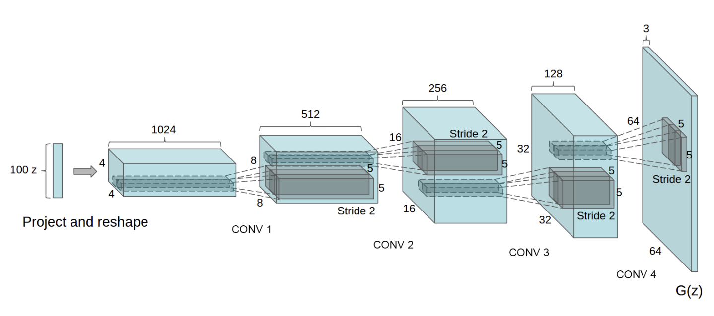
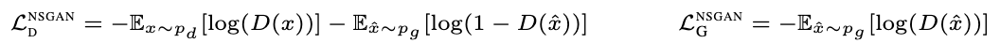
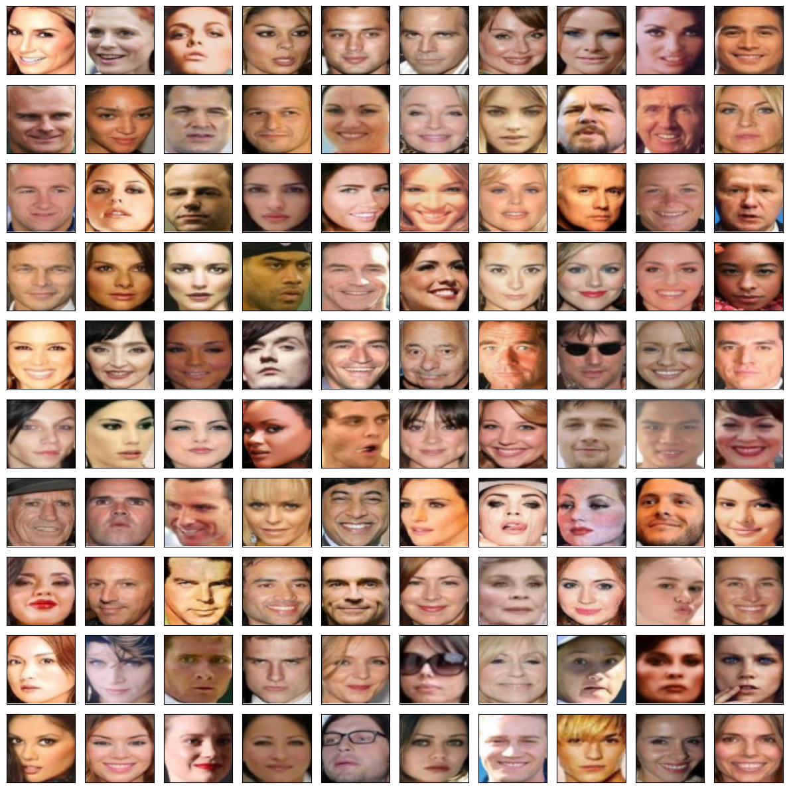
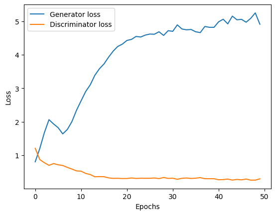
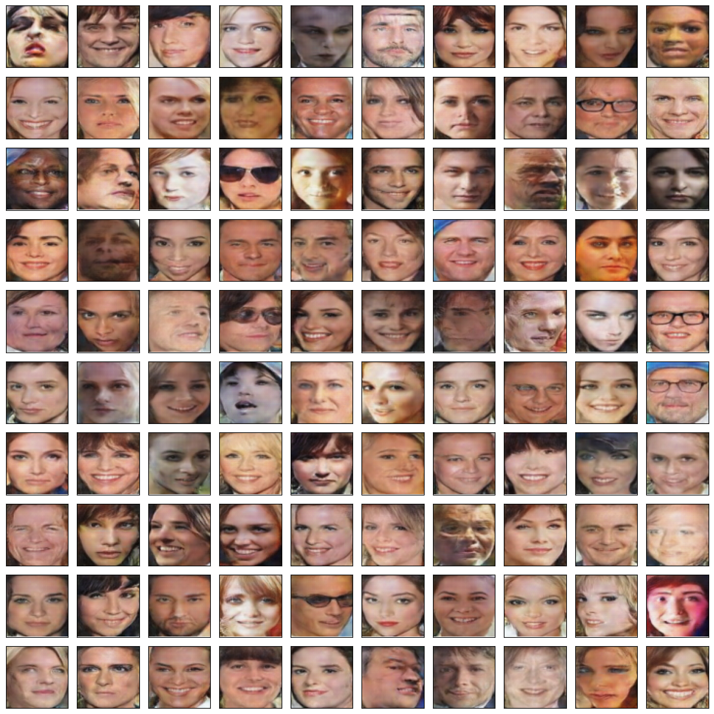
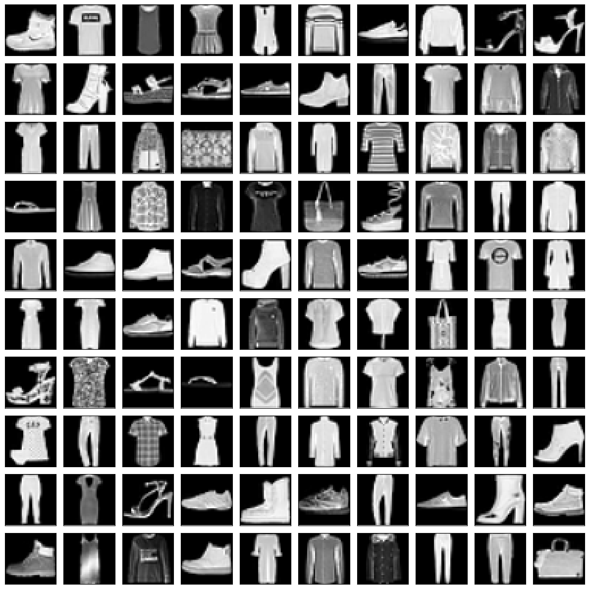
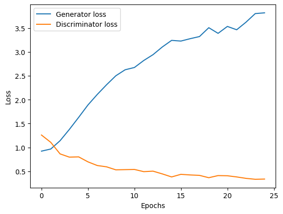
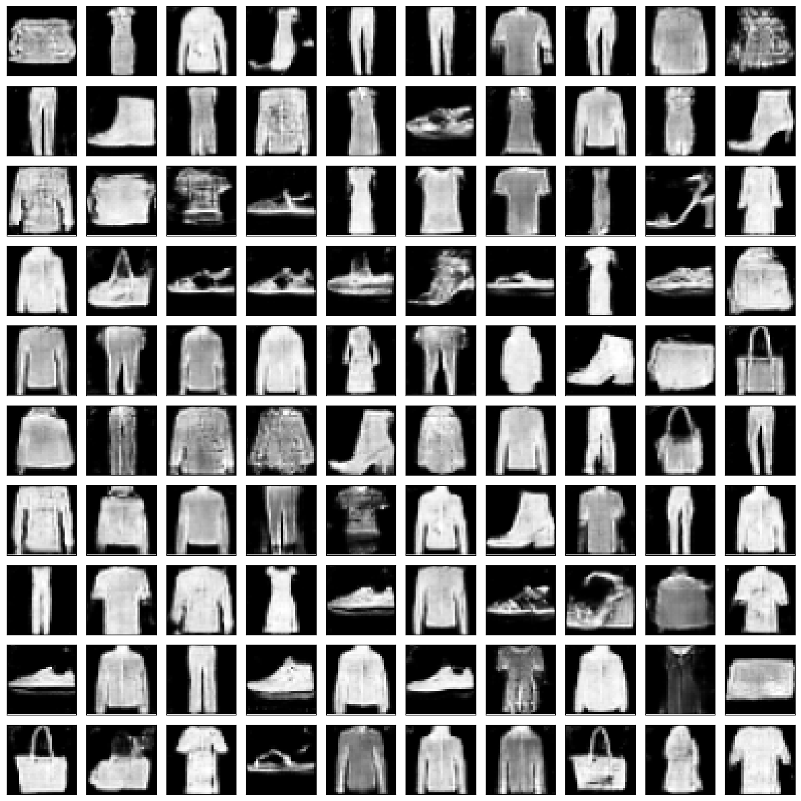

# DCGAN
PyTorch reimplementation of ["Unsupervised Representation Learning with Deep Convolutional Generative Adversarial Networks"](https://arxiv.org/abs/1511.06434) (Radford et al., 2016).



*Figure 1: DCGAN generator used for CelebFaces (Radford et al., 2016).*



*Equation 1: Loss of the discriminator and generator (Lucic et al., 2018).*

## CelebFaces

See `demo_celeb_faces.ipynb` for an example of a training procedure.

#### Architecture:

Generator:
* See the full architecture in `./src/dcgan.py`
* Kernel size = 4
* Stride = 2
* Padding = 1
* Learnable parameters: 12658435

Discriminator:
* See the full architecture in `./src/dcgan.py`
* Kernel size = 4
* Stride = 2
* Padding = 1
* Learnable parameters: 11036167

#### Training data:



#### DCGAN losses:


#### Fake data:



## FashionMNIST

See `demo_fashion_mnist.ipynb` for an example of a training procedure.

#### Architecture:

Generator:
* See the full architecture in `./src/dcgan.py`
* Kernel size = 4
* Stride = 2
* Padding = 2
* Learnable parameters: 12654337

Discriminator:
* See the full architecture in `./src/dcgan.py`
* Kernel size = 4
* Stride = 2
* Padding = 2
* Learnable parameters: 11032076

#### Training data:



#### DCGAN losses:


#### Fake data:




## Citations

```bibtex
@misc{radford2016unsupervisedrepresentationlearningdeep,
      title={Unsupervised Representation Learning with Deep Convolutional Generative Adversarial Networks}, 
      author={Alec Radford and Luke Metz and Soumith Chintala},
      year={2016},
      eprint={1511.06434},
      archivePrefix={arXiv},
      primaryClass={cs.LG},
      url={https://arxiv.org/abs/1511.06434}, 
}
```

```bibtex
@misc{goodfellow2014generativeadversarialnetworks,
      title={Generative Adversarial Networks}, 
      author={Ian J. Goodfellow and Jean Pouget-Abadie and Mehdi Mirza and Bing Xu and David Warde-Farley and Sherjil Ozair and Aaron Courville and Yoshua Bengio},
      year={2014},
      eprint={1406.2661},
      archivePrefix={arXiv},
      primaryClass={stat.ML},
      url={https://arxiv.org/abs/1406.2661}, 
}
```

```bibtex
@misc{lucic2018ganscreatedequallargescale,
      title={Are GANs Created Equal? A Large-Scale Study}, 
      author={Mario Lucic and Karol Kurach and Marcin Michalski and Sylvain Gelly and Olivier Bousquet},
      year={2018},
      eprint={1711.10337},
      archivePrefix={arXiv},
      primaryClass={stat.ML},
      url={https://arxiv.org/abs/1711.10337}, 
}
```

```bibtex
@inproceedings{liu2015faceattributes,
  title = {Deep Learning Face Attributes in the Wild},
  author = {Liu, Ziwei and Luo, Ping and Wang, Xiaogang and Tang, Xiaoou},
  booktitle = {Proceedings of International Conference on Computer Vision (ICCV)},
  month = {December},
  year = {2015} 
}
```